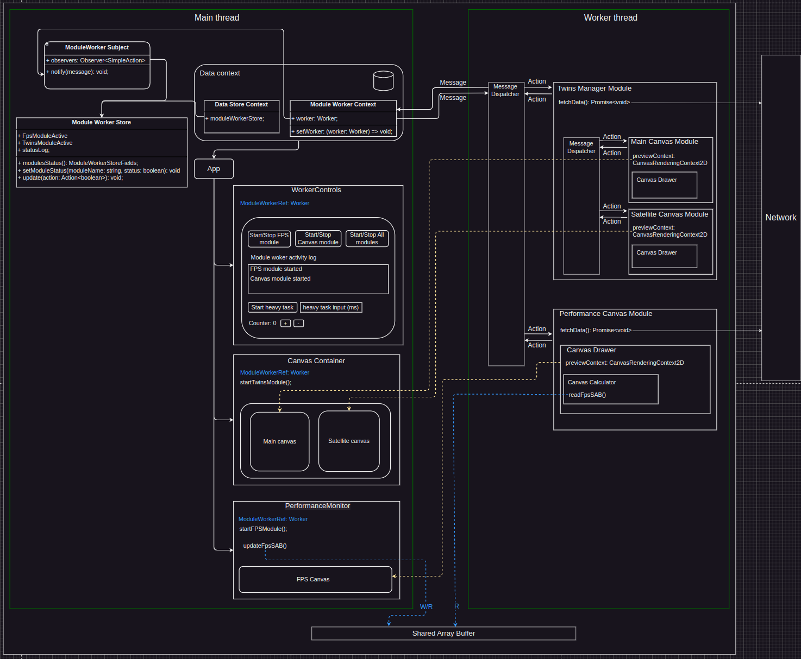

# Offscreen canvas with worker

### Description
This application has splited core. Main thread is responsible for hosting DOM elemtns and UI interactions. Worker thread(s) responsible for data fetching, processing and submission to the main thread.

### Application logic and data flow.
Main thread contains DOM element, including canvases, references to which are transferred to worker thread using [transferControlToOffscreen](https://developer.mozilla.org/en-US/docs/Web/API/HTMLCanvasElement/transferControlToOffscreen).
Worker thread uses `modules` to host several classes, communication between which provided with message dispatcher (Publisher).
Worker modules implement logic specific to the unit and can do data fetching, data calculation, data visualization (using reference to canvas) and read/write operations on SharedArrayBuffer.
Worker submits message to main thread, and notifies all store observers with new message data.

### Application architecture

### Preview
Please run `yarn build && yarn preview` to run app in preview mode.

### Used tech stack:
- TypeScript
- Vite
- React
- MobX
- Jest

### Used browser API:
- Web Workers
- SharedArrayBuffer
- OffscreenCanvas
- RequestAnimationFrame

### Setup for development

After cloning the project run following command `git config core.hooksPath .git-hooks` to enable git hooks.
